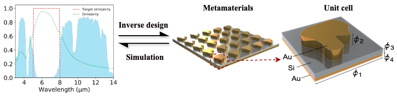
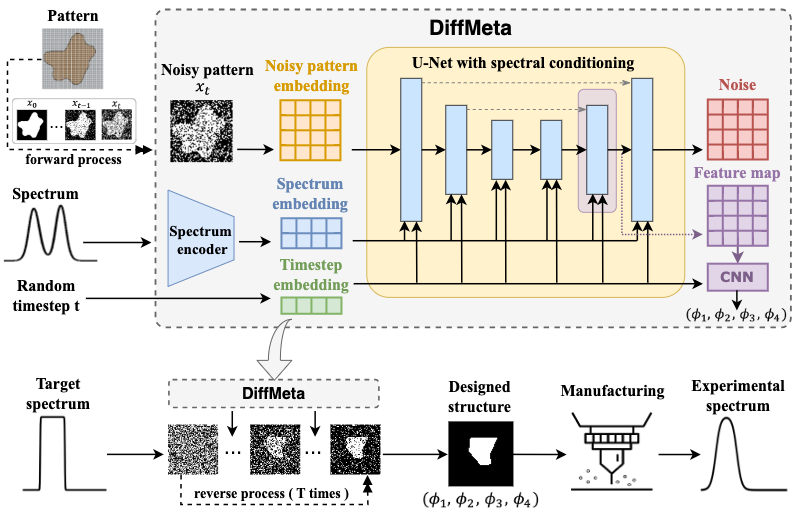

# DiffMeta: Inverse Design of Metamaterials with Manufacturing-Aware Spectrum-to-Shape Diffusion Models

This repository implements the paper [Inverse Design of Metamaterials with Manufacturing-Aware Spectrum-to-Shape Diffusion Models](https://www.arxiv.org/pdf/2506.07083).

## Introduction
### 1. The task description for inverse design of metamaterial:


As illustrated in the figure above, the MIM (Metal-Insulator-Metal) tri-layer metamaterial periodic structure used in this work consists of:
Top Layer: A free-form gold (Au) layer;
Middle Layer: An amorphous silicon (Si) insulator thin film;
Bottom Layer: A uniform gold (Au) thin film.

Given a desired spectrum, the inverse design task involves generating the optimal pattern and parameters for a 64×64 pixel periodic unit cell with 4-dimensional size composition parameters. The design parameters include pitch size (ϕ_1), height of the top shape pattern (ϕ_2), middle dielectric spacer size (ϕ_3), and bottom reflector size (ϕ_4). 

### 2. DiffMeta


## Data
The data used in this paper, including generated and training data, is publicly available on Zenodo. You can access it here: https://zenodo.org/records/12797962.

## Dependencies
### Conda environment
Please use our environment file to set up the required environment:
```
# Clone the environment
conda env create -f environment.yml
# Activate the environment
conda activate diffmeta
```
### S4 Installation
For spectral simulation, install S4 according to the [guidance](https://web.stanford.edu/group/fan/S4/install.html)

## Usage
### 1. Training DiffMeta
First, switch to the `diffmeta` folder and train the spectral autoencoder model:
```
python train_spec_encoder.py --spectrum_dim <dimension_of_spectrum>
```
Replace `<dimension_of_spectrum>` with the dimension of your spectrum data.

Once the spectral autoencoder is trained, proceed to train the DiffMeta model with the following command:
```
python train_diffmeta.py --spectrum_dim <dimension_of_spectrum>
```
Ensure that `<dimension_of_spectrum>` matches the dimension used in the spectral autoencoder training.

### 2. Training Benchmarks
Switch to the `benchmarks` folder to train and evaluate benchmark models for comparison.
First, train a forward simulator used in VAEMeta and GANMeta:
```
python simulator.py
```
Then, train VAEMeta and GANMeta using the following command:
```
python train_vaemeta.py --spectrum_dim <dimension_of_spectrum>
python train_ganmeta.py --spectrum_dim <dimension_of_spectrum>
```
### 3. Inference
To perform inference with a trained DiffMeta model and other benchmarks, switch to the `evaluation` folder and use the following:
```
python inference.py
```
### 4. Generate metamaterial structures for given spectra
To generate metamaterial structures based on specific spectra, run:
```
python generation.py --target_spectrum <target_spectrum_file_path> --models <which_models_to_use>
# Example
python generation.py --target_spectrum target.npy --models diff vae gan
```
### 5. Simulation
To simulate the optical properties of the generated metamaterials, switch to the `calculation_util` folder. `rcwa_calculator.py` provides an example of spectral simulation. Simulate the optical properties of the generated metamaterials according to the structure file format.


## Cite

If you reference or cite this work in your research, please cite:
'''
@misc{li2025inversedesignmetamaterialsmanufacturingguiding,
      title={Inverse Design of Metamaterials with Manufacturing-Guiding Spectrum-to-Structure Conditional Diffusion Model}, 
      author={Jiawen Li and Jiang Guo and Yuanzhe Li and Zetian Mao and Jiaxing Shen and Tashi Xu and Diptesh Das and Jinming He and Run Hu and Yaerim Lee and Koji Tsuda and Junichiro Shiomi},
      year={2025},
      eprint={2506.07083},
      archivePrefix={arXiv},
      primaryClass={physics.optics},
      url={https://arxiv.org/abs/2506.07083}, 
}
'''

